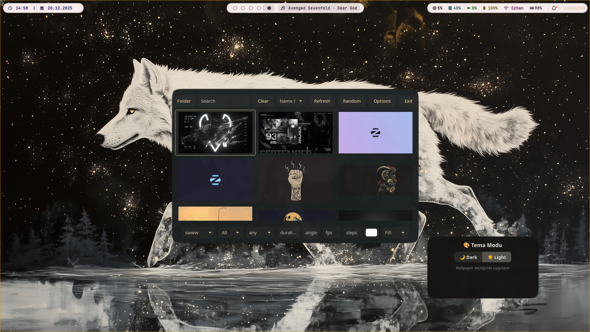
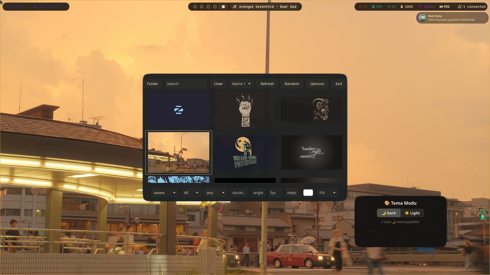
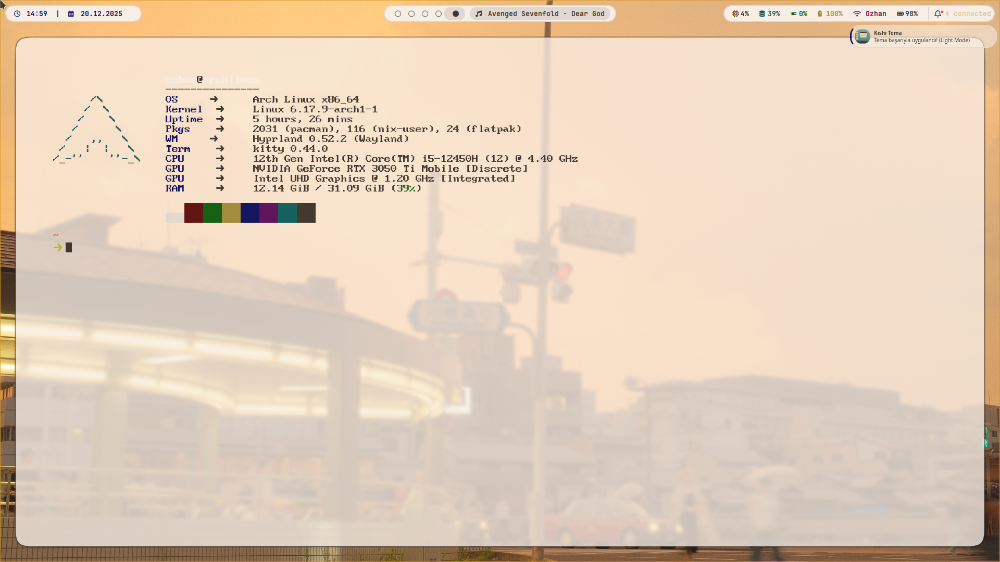
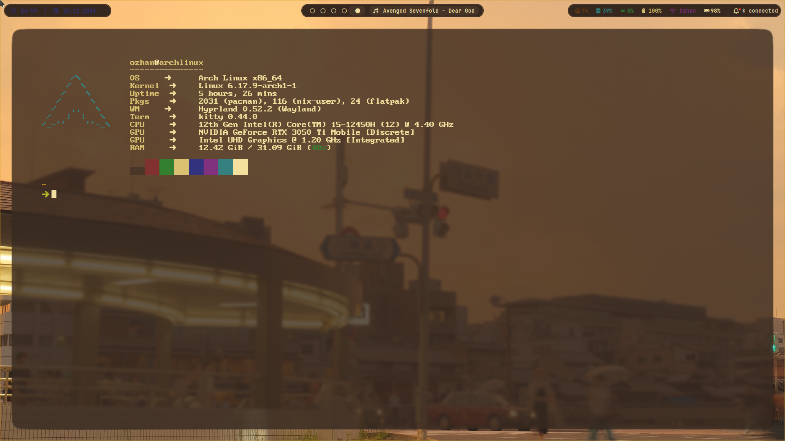
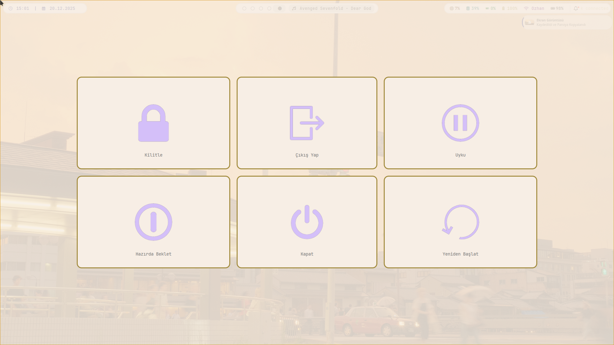
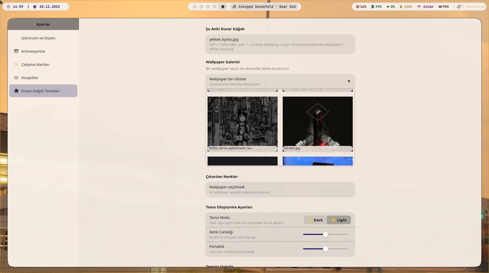
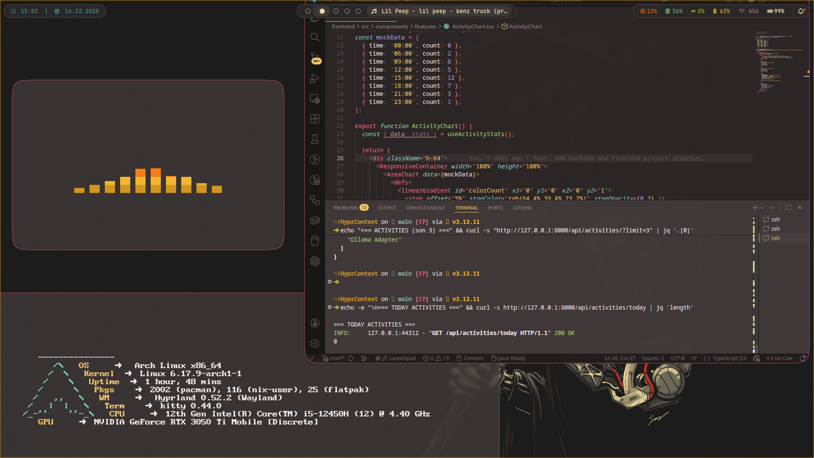

# 🎨 Arch Linux Hyprland - Gruvbox Theme


> **[TR]** Arch Linux üzerinde Hyprland pencere yöneticisi için hazırladığım, tamamen Gruvbox renk paletine sadık, performanslı ve animasyonlu yapılandırma dosyaları (Dotfiles).
>
> **[EN]** My personal, fully Gruvbox-themed, performance-oriented, and animated configuration files (Dotfiles) for Hyprland on Arch Linux.

---


> **[TR]** Arch Linux üzerinde Hyprland pencere yöneticisi için hazırladığım, tamamen Gruvbox renk paletine sadık, performanslı ve animasyonlu yapılandırma dosyaları (Dotfiles).
>
> **[EN]** My personal, fully Gruvbox-themed, performance-oriented, and animated configuration files (Dotfiles) for Hyprland on Arch Linux.

---

## 🇹🇷 Türkçe (Turkish)


### ✨ Özellikler

* **Pencere Yöneticisi:** Hyprland (Animasyonlu ve akıcı)
* **Panel:** Waybar (Gruvbox temalı, yüzen modüller)
* **Terminal:** Kitty + Zsh + Starship
* **Menü:** Rofi (Uygulama başlatıcı ve pencere geçişi)
* **Kilit Ekranı:** Hyprlock (Müzik widget'lı ve resimli)
* **Duvar Kağıdı:** Waypaper + SWWW (Animasyonlu geçişler)
* **Diğer:** Wlogout (Çıkış menüsü), SwayNC (Bildirim merkezi), Hypridle (Otomatik kilit)


### 🎛️ Kishi Settings (Ayarlar Uygulaması)

Hyprland ve 10+ uygulama için tam Gruvbox teması, dinamik light/dark mod, duvar kağıdı ile otomatik tema, gelişmiş ayarlar ve daha fazlası!

**Başlıca Özellikler:**

* 🎨 Tüm uygulamalara (Hyprland, Waybar, Rofi, Kitty, Wlogout, SwayNC, Hyprlock, Fastfetch, GTK, Powermenu...) otomatik tema
* 🌗 Dinamik light/dark mod (duvar kağıdına göre, kalıcı, anında değiştirilebilir)
* 🖼️ Waypaper entegrasyonu: Duvar kağıdı değişince tema otomatik uygulanır, light/dark toggle ile anında mod değişimi
* 🧩 Kendi arayüzünü de temalandırır (Libadwaita override, light mode metin görünürlüğü)
* 🗂️ Workspace yönetimi: Hyprland çalışma alanlarını ve monitörleri kolayca düzenle
* ⚡ Duvar kağıdı önbelleği: Hızlı küçük resimler, uygulama başında otomatik temizleme
* 🪟 Toggle penceresi için windowrules: Her zaman üstte, sabit boyut, doğru konum
* 💾 Kalıcı ayarlar (JSON): Son duvar kağıdı, mod, tercihler kaydedilir
* 🆕 **Yeni:** $mainMod+ALT+S ile Kishi Settings'i hızlı başlat (Hyprland keybind)


### 🚧 Gelecek Özellikler

**Kishi Settings için planlananlar:**


* [x] **Tema Yöneticisi:** Farklı Gruvbox varyantları arasında geçiş (Dark/Light/Soft) *(Light/Dark mod ve otomatik tema uygulama tamamlandı)*
* [x] **Animasyon Ayarları:** Pencere animasyonlarını özelleştirme *(Kishi Settings üzerinden temel animasyon ayarları yapılabiliyor)*
* [x] **Workspace Yönetimi:** Workspace düzeni ve davranışlarını ayarlama *(Kishi Settings'te temel workspace yönetimi var)*
* [x] **Pencere Kuralları:** Uygulamalara özel pencere davranışları tanımlama *(windowrules.conf ile temel kurallar mevcut)*
* [x] **Kısayol Düzenleyici:** Yeni kısayollar ekleme ve düzenleme *(README ve binds.conf ile kolay ekleme)*
* [ ] **Waybar Özelleştirme:** Modül görünürlüğü ve konumları
* [ ] **Monitör Ayarları:** Çoklu monitör yapılandırması
* [ ] **Başlangıç Uygulamaları:** Autostart uygulamalarını yönetme
* [ ] **Yedekleme/Geri Yükleme:** Ayarları yedekleme ve geri yükleme
* [ ] **Profil Yönetimi:** Farklı kullanım senaryoları için profiller

**Genel yapılandırma geliştirmeleri:**

* [ ] **Rofi Temaları:** Daha fazla Rofi tema seçeneği
* [ ] **Duvar Kağıdı Koleksiyonu:** Genişletilmiş Gruvbox duvar kağıdı seti
* [ ] **Hyprlock Widget'ları:** Hava durumu ve sistem bilgisi widget'ları
* [ ] **SwayNC Temaları:** Özelleştirilmiş bildirim görünümleri

---

## ⌨️ Hızlı Kısayollar

* **Kishi Settings'i aç:** `$mainMod+ALT+S` (Hyprland keybind)
* **Light/Dark mod toggle:** Waypaper veya Kishi Settings üzerinden
* **Tema otomasyonu:** Duvar kağıdı değişince otomatik tema

---

## 🛠️ Gereksinimler ve Kurulum

Bu yapılandırmayı kullanmak için aşağıdaki paketlerin sisteminizde yüklü olması gerekir (Arch Linux / Yay):


### Araçlar & Görünüm

```bash
yay -S hyprland waybar rofi-wayland kitty swww waypaper swaync wlogout hyprlock hypridle
yay -S starship fastfetch grim slurp swappy cliphist thunar nwg-look ttf-jetbrains-mono-nerd
yay -S gruvbox-dark-gtk-theme gruvbox-plus-icon-theme-git bibata-cursor-theme
```

### Kishi Settings için ek Python bağımlılıkları

```bash
yay -S python python-pip python-pillow python-scikit-learn python-gobject
pip install --user pillow scikit-learn pygobject
```
```


### 🚀 Kurulum Adımları

1. Bu repoyu indirin:
   ```bash
   git clone https://github.com/ozhangebesoglu/kishi-dots.git
   cd kishi-dots
   ```
2. Config dosyalarını `.config` klasörünüze kopyalayın:
   ```bash
   cp -r Config/* ~/.config/
   ```
3. Duvar kağıtlarını Resimler klasörüne taşıyın ve Waypaper ile seçin.
4. Kishi Settings uygulamasını başlatmak için:
   ```bash
   cd Kishi-Settings
   python main.py
   ```

---


---

## 🇬🇧 English

### ✨ Features

* **Window Manager:** Hyprland (Animated, smooth)
* **Bar:** Waybar (Gruvbox themed, floating modules)
* **Terminal:** Kitty + Zsh + Starship
* **Menu:** Rofi (App launcher and window switcher)
* **Lock Screen:** Hyprlock (With music widget and artwork)
* **Wallpaper:** Waypaper + SWWW (Animated transitions)
* **Other:** Wlogout (logout menu), SwayNC (notification center), Hypridle (auto lock)

### 🎛️ Kishi Settings (Settings App)

* 🎨 Automatic Gruvbox theming for all apps (Hyprland, Waybar, Rofi, Kitty, Wlogout, SwayNC, Hyprlock, Fastfetch, GTK, Powermenu...)
* 🌗 Dynamic light/dark mode (auto, persistent, instant toggle)
* 🖼️ Waypaper integration: Theme auto-applies on wallpaper change, instant light/dark toggle
* 🧩 Self-theming UI (Libadwaita override, light mode text contrast)
* 🗂️ Workspace management: Easily organize Hyprland workspaces and monitors
* ⚡ Wallpaper cache: Fast thumbnails, auto-clean on app start
* 🪟 Windowrules for toggle window: Always on top, fixed size, correct position
* 💾 Persistent settings (JSON): Last wallpaper, mode, preferences saved
* 🆕 **New:** Launch Kishi Settings instantly with `$mainMod+ALT+S` (Hyprland keybind)

### 🚧 Roadmap

**Planned for Kishi Settings:**

* [x] **Theme Manager:** Switch between Gruvbox variants (Dark/Light/Soft) *(Light/Dark mode and auto theme apply done)*
* [x] **Animation Settings:** Customize window animations *(Basic animation settings available in Kishi Settings)*
* [x] **Workspace Management:** Configure workspace layouts and behaviors *(Basic workspace management in Kishi Settings)*
* [x] **Window Rules:** Define app-specific window behaviors *(windowrules.conf provides basic rules)*
* [x] **Keybind Editor:** Add and edit custom keybindings *(Easy add via README and binds.conf)*
* [ ] **Waybar Customization:** Module visibility and positioning
* [ ] **Monitor Settings:** Multi-monitor configuration
* [ ] **Startup Applications:** Manage autostart apps
* [ ] **Backup/Restore:** Backup and restore settings
* [ ] **Profile Management:** Profiles for different use cases

**General configuration improvements:**

* [ ] **Rofi Themes:** More Rofi theme options
* [ ] **Wallpaper Collection:** Extended Gruvbox wallpaper set
* [ ] **Hyprlock Widgets:** Weather and system info widgets
* [ ] **SwayNC Themes:** Custom notification appearances
* [ ] **Audio/Brightness OSD:** Custom on-screen display design
* [ ] **Waybar Modules:** Additional modules like music player, system monitor


---

---


### 🖼️ Gallery / Galeri

#### Masaüstü & Terminal
| Masaüstü | Terminal (Kitty) | Light Mode | Dark Mode |
| :---: | :---: | :---: | :---: |
|  |  |  |  |

#### Terminal Temaları
| Light Terminal | Dark Terminal |
| :---: | :---: |
|  |  |

#### Menüler & Arayüz
| Rofi Launcher | Bildirim Merkezi | Wlogout | Ayarlar | Arama |
| :---: | :---: | :---: | :---: | :---: |
|  |  |  |  |  |

#### Kilit Ekranı
| Lock Screen | Lock Screen (Alternatif) |
| :---: | :---: |
|  |  |

#### Genel Görünüm
| Genel Görünüm |
| :---: |
|  |

#### Video
| Demo |
| :---: |
|  |

**Author:** Özhan  
**License:** MIT