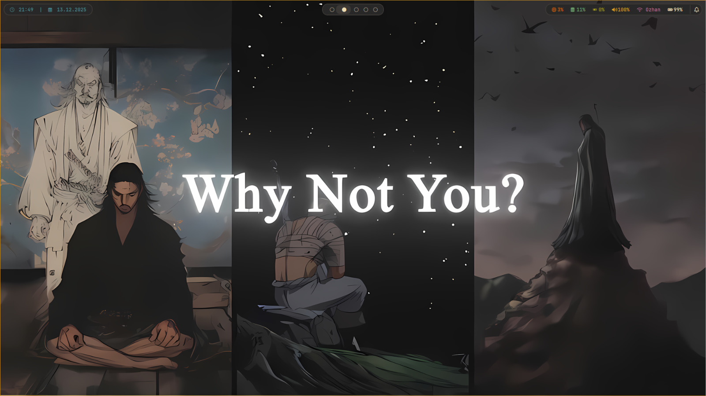
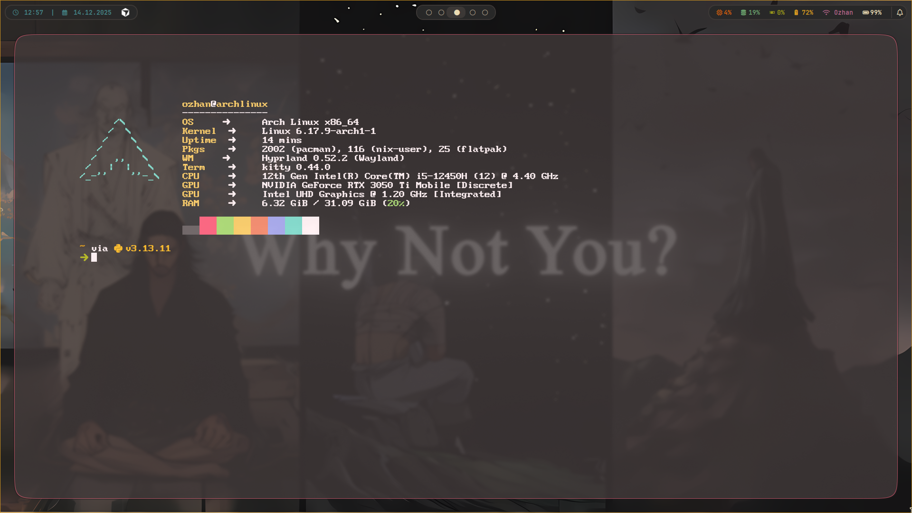
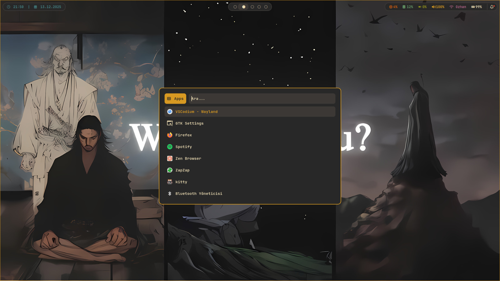
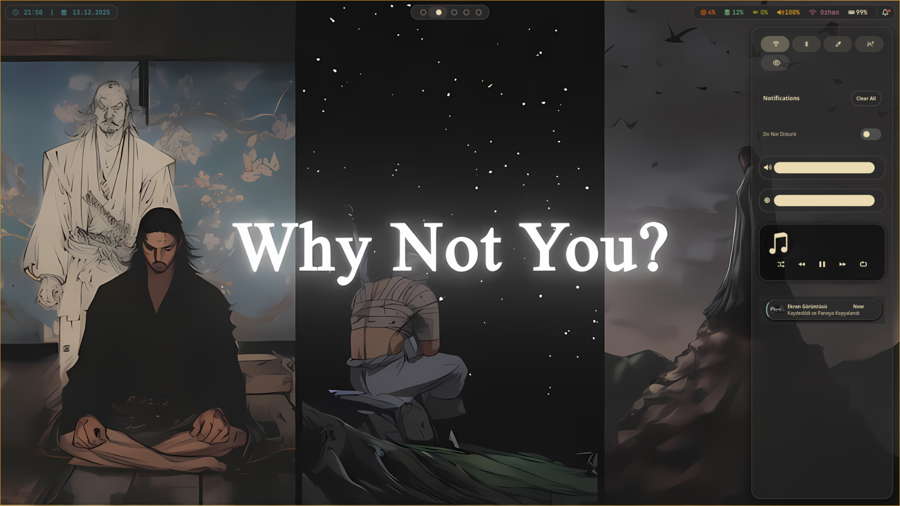
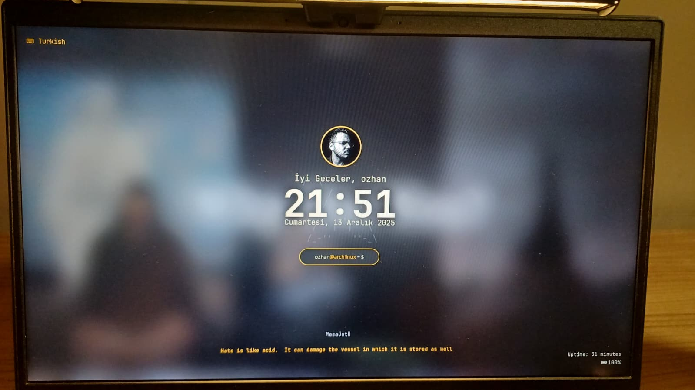
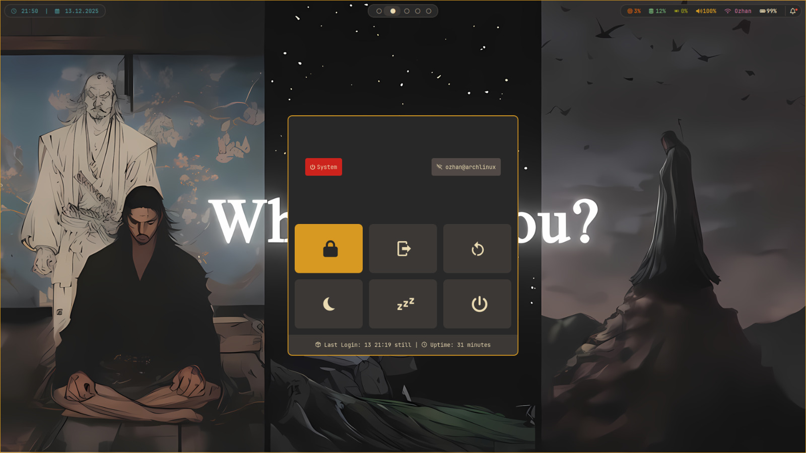
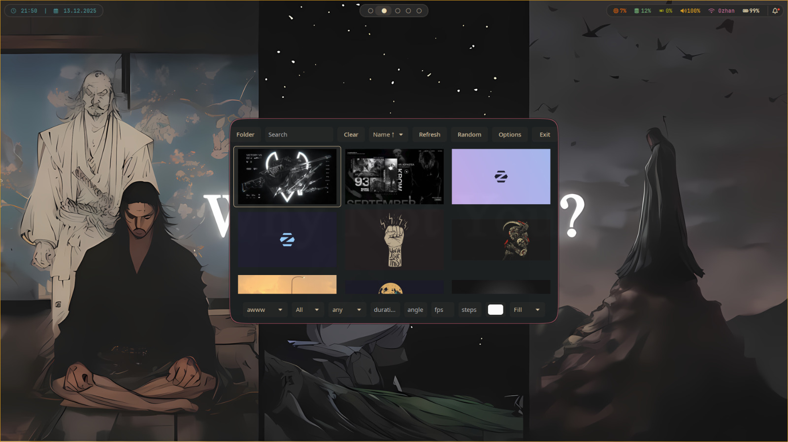

# 🎨 Arch Linux Hyprland - Gruvbox Theme



> **[TR]** Arch Linux üzerinde Hyprland pencere yöneticisi için hazırladığım, tamamen Gruvbox renk paletine sadık, performanslı ve animasyonlu yapılandırma dosyaları (Dotfiles).
>
> **[EN]** My personal, fully Gruvbox-themed, performance-oriented, and animated configuration files (Dotfiles) for Hyprland on Arch Linux.

---

## 🇹🇷 Türkçe (Turkish)

### ✨ Özellikler
* **Pencere Yöneticisi:** Hyprland (Animasyonlu ve akıcı)
* **Panel:** Waybar (Gruvbox temalı, yüzen modüller)
* **Terminal:** Kitty + Zsh + Starship
* **Menü:** Rofi (Uygulama başlatıcı ve pencere geçişi)
* **Kilit Ekranı:** Hyprlock (Müzik widget'lı ve resimli)
* **Duvar Kağıdı:** Waypaper + SWWW (Animasyonlu geçişler)
* **Diğer:** Wlogout (Çıkış menüsü), SwayNC (Bildirim merkezi), Hypridle (Otomatik kilit)

### 📦 Kurulum (Gereksinimler)
Bu yapılandırmayı kullanmak için aşağıdaki paketlerin sisteminizde yüklü olması gerekir (Arch Linux / Yay):

```bash
# Temel Bileşenler
yay -S hyprland waybar rofi-wayland kitty swww waypaper swaync wlogout hyprlock hypridle

# Araçlar & Görünüm
yay -S starship fastfetch grim slurp swappy cliphist thunar nwg-look ttf-jetbrains-mono-nerd
yay -S gruvbox-dark-gtk-theme gruvbox-plus-icon-theme-git bibata-cursor-theme
```

### 🚀 Nasıl Kurulur?
1. Bu repoyu indirin:
   ```bash
   git clone https://github.com/ozhangebesoglu/kishi-dots.git
   cd kishi-dots
   ```
2. Config dosyalarını `.config` klasörünüze kopyalayın:
   ```bash
   cp -r Config/* ~/.config/
   ```
3. Duvar kağıtlarını Resimler klasörüne taşıyın ve Waypaper ile seçin.

---

## 🇬🇧 English


### ✨ Features
* **Window Manager:** Hyprland (Animated and smooth)
* **Bar:** Waybar (Gruvbox themed, floating modules)
* **Terminal:** Kitty + Zsh + Starship
* **Menu:** Rofi (App launcher and window switcher)
* **Lock Screen:** Hyprlock (With music widget and artwork)
* **Wallpaper:** Waypaper + SWWW (Animated transitions)
* **Others:** Wlogout (Logout menu), SwayNC (Notification center), Hypridle (Auto lock)

### 📦 Installation (Requirements)
To use this configuration, ensure the following packages are installed (Arch Linux / Yay):

```bash
# Core Components
yay -S hyprland waybar rofi-wayland kitty swww waypaper swaync wlogout hyprlock hypridle

# Tools & Appearance
yay -S starship fastfetch grim slurp swappy cliphist thunar nwg-look ttf-jetbrains-mono-nerd
yay -S gruvbox-dark-gtk-theme gruvbox-plus-icon-theme-git bibata-cursor-theme
```

### 🚀 How to Install?
1. Clone this repo:
   ```bash
   git clone https://github.com/ozhangebesoglu/kishi-dots.git
   cd kishi-dots
   ```
2. Copy config files to your `.config` directory:
   ```bash
   cp -r Config/* ~/.config/
   ```
3. Move wallpapers to your Pictures folder and select one using Waypaper.

---

### 🖼️ Gallery / Galeri

#### Desktop & Terminal
| Desktop | Terminal (Kitty) |
| :---: | :---: |
|  |  |

#### Menüler & Arayüz
| Rofi Launcher | Bildirim Merkezi |
| :---: | :---: |
|  |  |

#### Kilit Ekranı
| Lock Screen | Lock Screen (Alternatif) |
| :---: | :---: |
|  |  |

#### Genel Görünüm
| Genel Görünüm |
| :---: |
|  |

---
**Author:** Özhan  
**License:** MIT